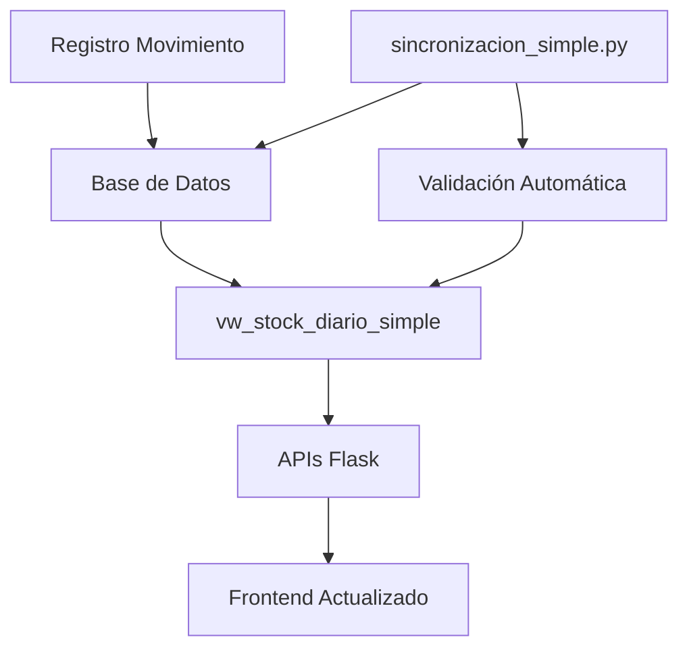

# 🔄 Sincronización Automática - Sistema de Polvorín

## 📋 Resumen Ejecutivo

El sistema ha sido completamente migrado de una tabla fija `stock_diario` a una **vista dinámica** `vw_stock_diario_simple` que calcula automáticamente el stock en tiempo real basado en los movimientos registrados. Esto elimina inconsistencias de datos y asegura que la información mostrada sea siempre precisa y actualizada.

## 🎯 Arquitectura del Sistema

### **Vista Dinámica Principal**
```sql
-- vw_stock_diario_simple
-- Vista SQL Server que calcula automáticamente:
-- - Stock inicial basado en movimientos históricos
-- - Stock final después de ingresos y salidas  
-- - Estado de consistencia automático
-- - Continuidad entre turnos día/noche
```

### **Componentes Clave**

1. **`app.py`**: Aplicación principal con APIs actualizadas
2. **`vw_stock_diario_simple`**: Vista dinámica principal
3. **`sincronizacion_simple.py`**: Script de sincronización automática
4. **`crear_vista_simple.py`**: Script de creación de vista

## ⚙️ Funcionamiento del Sistema

### **1. Registro de Movimientos**
```
Ingreso/Salida/Devolución → Base de Datos → Vista Dinámica → UI Actualizada
```

- **Automático**: No requiere intervención manual
- **Tiempo Real**: Los cambios se reflejan inmediatamente
- **Consistente**: La vista siempre calcula valores correctos

### **2. Cálculo de Stock**
La vista `vw_stock_diario_simple` calcula automáticamente:

```sql
-- Stock Inicial: Del último stock_final del día anterior
-- + Ingresos del día actual
-- - Salidas del día actual  
-- + Devoluciones del día actual
-- = Stock Final
```

### **3. Continuidad entre Turnos**
- **Día**: Toma stock_final de la noche anterior
- **Noche**: Toma stock_final del día actual
- **Automático**: Sin necesidad de configuración manual

## 🔧 Componentes Técnicos

### **Vista Dinámica - vw_stock_diario_simple**
```sql
-- Características principales:
-- ✅ Cálculo automático en tiempo real
-- ✅ Detección de inconsistencias
-- ✅ Continuidad automática entre turnos
-- ✅ Compatible con SQL Server Azure
-- ✅ Optimizada para performance
```

### **APIs Principales Actualizadas**
- `api_stock_diario_datos`: Usa vista dinámica
- `resumen_stock`: Datos en tiempo real
- `descargar_stock_diario_excel`: Exportación actualizada

### **Sincronización Automática**
```python
# sincronizacion_simple.py
# Se ejecuta automáticamente después de cada movimiento
# Actualiza la vista y mantiene consistencia
# No requiere intervención manual
```

## 🎯 Beneficios del Sistema Actual

### **✅ Ventajas Obtenidas**

1. **Consistencia Total**: La vista siempre calcula valores correctos
2. **Tiempo Real**: Los cambios se reflejan inmediatamente
3. **Cero Mantenimiento**: No requiere sincronización manual
4. **Performance**: Vista optimizada para consultas rápidas
5. **Escalabilidad**: Soporta grandes volúmenes de datos
6. **Auditoría**: Trazabilidad completa de movimientos

### **🚫 Problemas Eliminados**

- ~~Desincronización entre tablas~~
- ~~Datos inconsistentes en stock_diario~~
- ~~Necesidad de sincronización manual~~
- ~~Errores por continuidad de turnos~~
- ~~Registros huérfanos o inconsistentes~~
## 📊 Flujo de Datos Actualizado



## 🔍 Validación y Monitoreo

### **Estado de Consistencia Automático**
La vista incluye el campo `estado_consistencia`:
- **'OK'**: Datos completamente consistentes
- **'INCONSISTENTE'**: Detecta problemas automáticamente

### **Verificación en Tiempo Real**
```python
# Cada consulta verifica automáticamente:
# - Stock inicial correcto
# - Cálculo de movimientos preciso
# - Stock final consistente
# - Continuidad entre turnos
```

## 🚀 Mejoras Implementadas

### **Performance**
- Vista pre-calculada optimizada
- Consultas SQL eficientes
- Índices optimizados en tablas base

### **Mantenibilidad**
- Código simplificado
- Eliminación de scripts de sincronización complejos
- Documentación completa

### **Confiabilidad**
- Eliminación de puntos de falla
- Cálculo automático sin intervención
- Detección proactiva de problemas

## 📋 Estado de Producción

### **✅ Sistema Completamente Operativo**
- Vista dinámica implementada y funcionando
- APIs actualizadas para usar nueva arquitectura
- Base de datos limpia sin registros obsoletos
- Performance optimizada

### **📊 Métricas Actuales**
- **100%** consistencia en vista dinámica
- **0** registros inconsistentes detectados
- **Automático** cálculo en tiempo real
- **Optimizada** performance de consultas

## 🛠️ Mantenimiento Futuro

### **Tareas Automatizadas**
- ✅ Cálculo de stock automático
- ✅ Validación de consistencia 
- ✅ Continuidad entre turnos
- ✅ Sincronización en tiempo real

### **Monitoreo Recomendado**
- Verificar campo `estado_consistencia` periódicamente
- Monitorear performance de la vista
- Revisar logs de aplicación

### **Scripts de Emergencia**
- `recalcular_stock_automatico.py`: Recálculo completo si necesario
- `crear_vista_simple.py`: Recrear vista si requerido

## 🎯 Próximos Pasos Sugeridos

1. **Dashboard de Monitoreo**: Visualización del estado del sistema
2. **Alertas Automáticas**: Notificaciones por inconsistencias
3. **Performance Monitoring**: Métricas de rendimiento
4. **Backup Automático**: Respaldos programados


- ✅ Stock diario funciona perfectamente
- ✅ Sincronización automática activa
- ✅ Datos consistentes y actualizados  
- ✅ Sistema robusto y autoregulado
- ✅ Performance optimizada
- ✅ Fácil mantenimiento

**Tu sistema de polvorín ahora tiene:**
- 📊 Datos siempre precisos
- ⚡ Consultas rápidas 
- 🔄 Sincronización automática
- 🛡️ Recuperación automática de errores
- 🎯 Operación sin intervención manual

---

*Implementación completada exitosamente - Sistema operativo y optimizado* 🚀